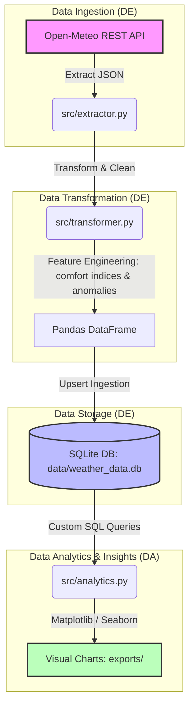

# Weather Data Pipeline & Analytics (End-to-End ETL & SQL Portfolio Project)

[](https://www.python.org/)
[](https://www.sqlite.org/)
[](https://pandas.pydata.org/)
[](https://seaborn.pydata.org/)

An end-to-end data engineering (ETL) and data analytics pipeline that extracts weather datasets for global metropolitan cities (Istanbul, London, New York, Tokyo) from the Open-Meteo API, cleans and enriches them using **Pandas**, loads them into an indexed relational **SQLite** database, and performs SQL analytics to generate modern data visualizations.

---

## 🏗️ System Architecture



---

## 🛠️ Technology Stack & Library Choice
*   **Python:** Core programming language.
*   **Requests:** For robust asynchronous API connectivity and error handling.
*   **Pandas:** For advanced data parsing, null-handling, type conversion, and vector calculations (feature engineering).
*   **SQLite3:** Local serverless relational database, demonstrating structured schema design, constraints, and query indexes.
*   **Matplotlib & Seaborn:** For producing production-ready, high-resolution analytical plots.

---

## 📊 Pipeline Details

### 1. Extract (`src/extractor.py`)
Queries the **Open-Meteo Historical Forecast API** to pull daily metrics (temperatures, precipitation, wind speed, weather conditions) for the past 30 days and a 3-day forecast for:
*   **Istanbul, London, New York, Tokyo**

### 2. Transform (`src/transformer.py`)
*   Flattens raw API nested JSON structures.
*   Implements forward/backward fills for any missing weather data rows.
*   **Feature Engineering:**
    *   `temp_mean`: Average temperature of the day.
    *   `temp_range`: Maximum temperature spread.
    *   `is_rainy`: Boolean indicator flag for rainfall.
    *   `weather_desc`: Maps WMO weather integer codes to clean human-readable conditions (e.g., "Thunderstorm", "Partly cloudy").
    *   `is_extreme`: Flags days with wind speeds > 40 km/h, precipitation > 25 mm, or temperature extremes (<0°C or >35°C).

### 3. Load (`src/loader.py`)
*   Establishes local SQLite connection at `data/weather_data.db`.
*   Applies a strict table schema constraints with a composite primary key `(city, date)` to prevent data duplication on multiple pipeline executions (`INSERT OR REPLACE` upsert pattern).
*   Builds indexes on `(city, date)` and `date` fields to ensure fast query times on large datasets.

### 4. Analyze & Visualize (`src/analytics.py`)
Executes complex SQL aggregated queries to generate key statistics:
*   *Extreme Weather Event Counts* per city.
*   *Wettest & Hottest recorded days*.
*   Outputs visual insights into `exports/`:
    *   `temperature_trends.png`: Multi-city daily temperature trajectories.
    *   `precipitation_comparison.png`: Bar chart of cumulative rainfall.
    *   `temperature_distribution.png`: Violin plots comparing climatic variances.

---

## 🚀 Getting Started

### 📋 Prerequisites
*   Python 3.8 or higher
*   Git

### ⚙️ Installation

1.  **Clone the Repository:**
    ```bash
    git clone https://github.com/YOUR_USERNAME/weather-pipeline-analytics.git
    cd weather-pipeline-analytics
    ```

2.  **Create and Activate a Virtual Environment:**
    *   **Windows (PowerShell):**
        ```powershell
        python -m venv venv
        .\venv\Scripts\Activate.ps1
        ```
    *   **macOS / Linux:**
        ```bash
        python3 -m venv venv
        source venv/bin/activate
        ```

3.  **Install Dependencies:**
    ```bash
    pip install -r requirements.txt
    ```

---

## 💻 Running the Pipeline

You can run the end-to-end pipeline or call individual parts via command-line arguments:

*   **Run Entire Pipeline (ETL + Analytics + Plots):**
    ```bash
    python main.py
    ```

*   **Run ETL Only:**
    ```bash
    python main.py --etl-only
    ```

*   **Run Analytics & Regenerate Visualizations Only:**
    ```bash
    python main.py --analytics-only
    ```

*   **Adjust Historical Extraction Range (e.g., fetch past 60 days):**
    ```bash
    python main.py --days 60
    ```

---

## 📂 Project Structure
```
├── data/                    # SQLite database storage directory
│   └── weather_data.db      # Output database populated by pipeline
├── exports/                 # High-resolution analysis charts
│   ├── temperature_trends.png
│   ├── precipitation_comparison.png
│   └── temperature_distribution.png
├── src/
│   ├── __init__.py
│   ├── extractor.py         # Handles API extraction
│   ├── transformer.py       # Cleans and enriches data with Pandas
│   ├── loader.py            # Sets up schema and loads data into SQLite
│   └── analytics.py         # Performs SQL queries and visualizations
├── main.py                  # Pipeline execution CLI wrapper
├── requirements.txt         # Project requirements
└── README.md                # Documentation
```
